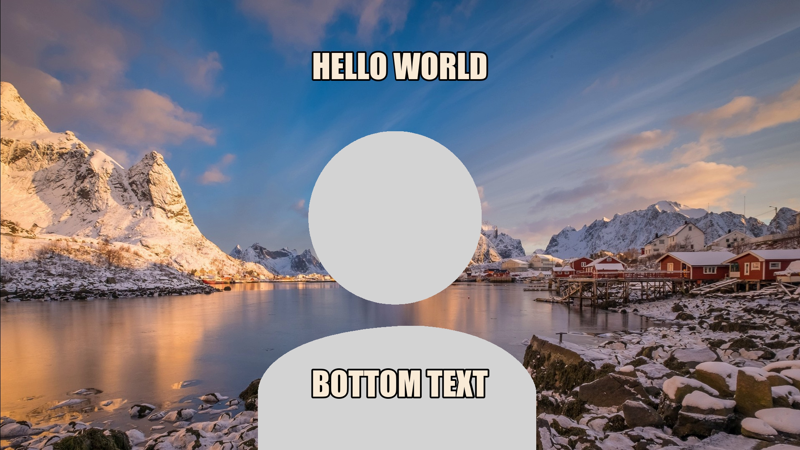
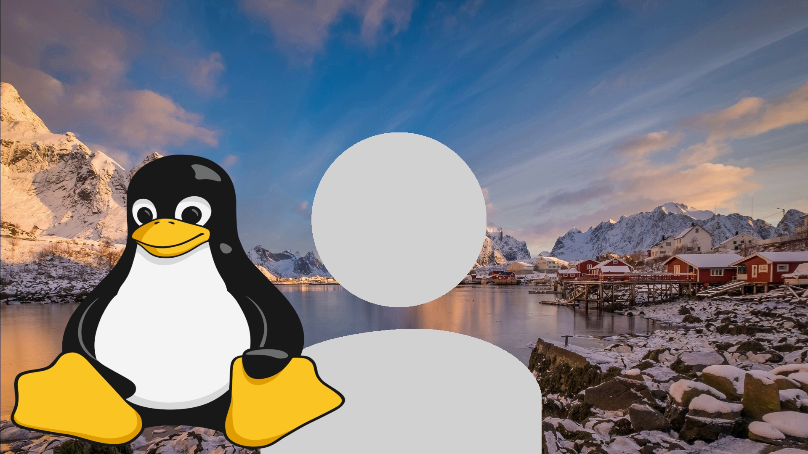
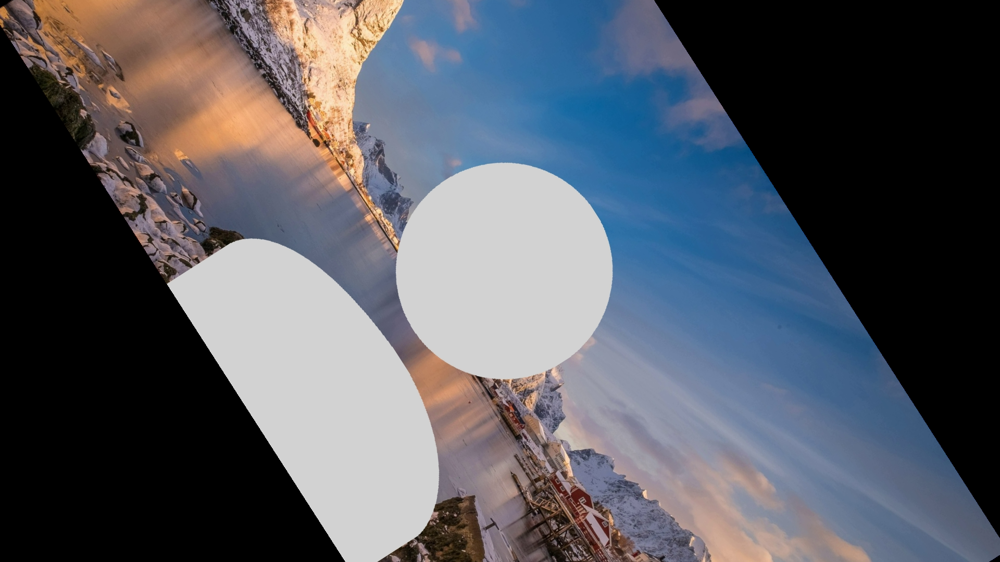
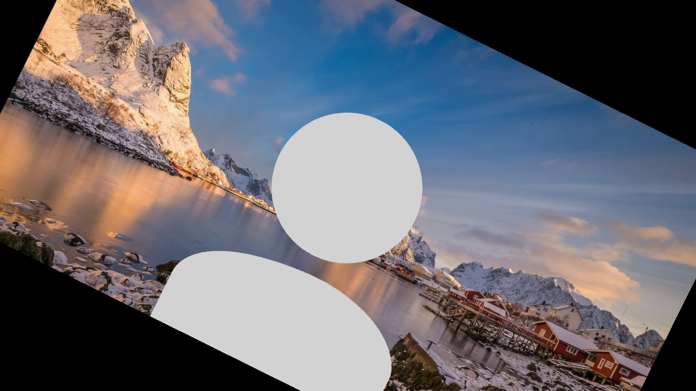
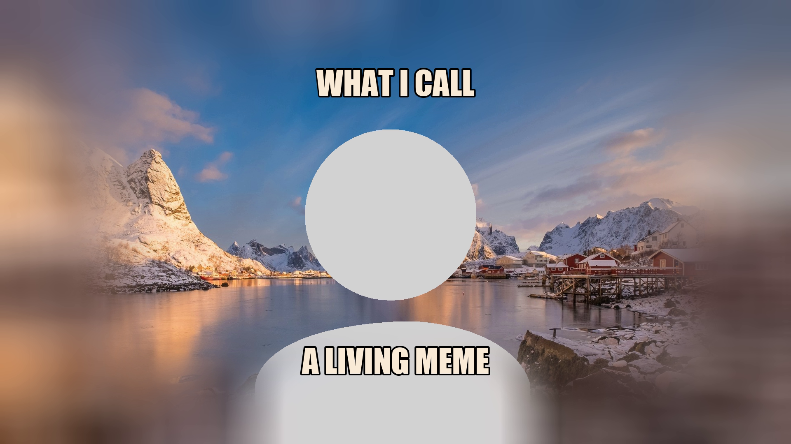

# Webcam Video Effects 

Webcam Video Effects is a fast, lightweight webcam video enhancer. Add effects like a blurred background, overlayed images, and text to your webcam feed. This uses ffmpeg and v4l2loopback to output to a virtual webcam, which supports all video calls, including Zoom, WebEx, and Google Meet.

Before | After
:-----:|:------:
 | 

## Installation

Clone the repository and install the dependencies below.

Debian:
```sh
sudo apt-get install ffmpeg v4l2loopback-dkms
```
Arch:
```sh
sudo pacman -S ffmpeg v4l2loopback-dkms
```

Ensure that v4l2loopback-dkms is at version 0.12.5-1 or later to ensure full functionality.

## Setup

To create a blank virtual webcam (that this script can stream to), first turn on the webcam with the `-a` flag:
```sh
./weffe -a
```
_NOTE_: If you ran this command after starting an application like Zoom, you will have to restart Zoom to see the new webcam.

## Usage

Running `./weffe` without arguments streams to a webcam with no effects. Insert one or more command line arguments to add effects to the video. These effects can all be used together unless otherwise specified.

### Blur

This program blurs out pixels on the outer edge of the webcam feed and keeps the center in focus. There are a few options for the shape of this focused section, namely `square`, `rect`, `portrait`, `circle`, and `ellipse`. All blur options fade into the background so there's no hard line separating the blurred video from the face. Different blur shapes can be used depending on how much space should be focused, for example, if multiple people are next to each other on a call. To add a blur, use the `-B` flag. To make the blur stronger, also append the `-S` flag as shown below:

Command | Output
:-----:|:------:
`./weffe -B portrait` | 
`./weffe -SB rect` | 

### Meme-ifying a Video

Adding top and bottom text to a video turns your video camera into a large meme, adding white text (with a black border) to the inputted media. Additionally, the `-f` flag allows you to select a font (default Arial, although Impact looks better if you've installed it). Replacing the text with text files allows you to update the text on the video (by changing the file's text) without pausing the webcam stream.

Command | Output
:-----:|:------:
`./weffe -t "HELLO WORLD" -b "BOTTOM TEXT" -f "Impact"` or <br /> `./weffe -t toptext.txt -b bottomtext.txt` | 

### Image Overlay

Add an image over your screen - like a picture frame, company logo, or anything that you want using the `-w` flag (watermark). This should have transparency so that your video can still be seen behind it.
Command | Output
:-----:|:------:
`./weffe -w static/tux.png` | 

### Rotation

This script supports continuously rotating your webcam video over time. Adding the `-r` flag continously rotates the stream at a fixed rate over time. For example, the following command rotates the input video stream in circles over time:

However, you can also create fancier rotations by making rotation angle a function of time using the `-z` flag. The syntax for this rotation can be found [here](https://ffmpeg.org/ffmpeg-all.html#Examples-136). The below example shows how to make a video stream oscillate like a pendulum using a sine function.

Command | Output
:-----:|:------:
`./weffe -r` | 
`./weffe -z "1/2*sin(PI/2*t)"` | 


### Looping a Video to the Webcam

Save a video file in the directory. Most video formats should work with this script. I recommend using [Guvcview](http://guvcview.sourceforge.net/) for taking videos using the webcam.  
Then, run the video looper script to generate a lengthened video and stream it to `/dev/video2`. This will create a longer mp4 file that gets streamed to the webcam. By default, the video gets duplicated and played in reverse after it completes so that there is no "jump" from the last frame to the first. To remove this functionality (and never play the video in reverse), also add the `-s` (skip processing) flag.
```sh
./weffe -v your_video.mp4
./weffe -sv dont_reverse_this_video.mp4
```

### Extra Options

For more options, run the following command (or read the help page):
```sh
./weffe -h
```

## More Examples

Command | Output
:-----:|:------:
`./weffe -B portrait -w static/solid_frame.png` | 
`./weffe -B rect -t "what i call" -b "a living meme" -f "Impact"` | 
